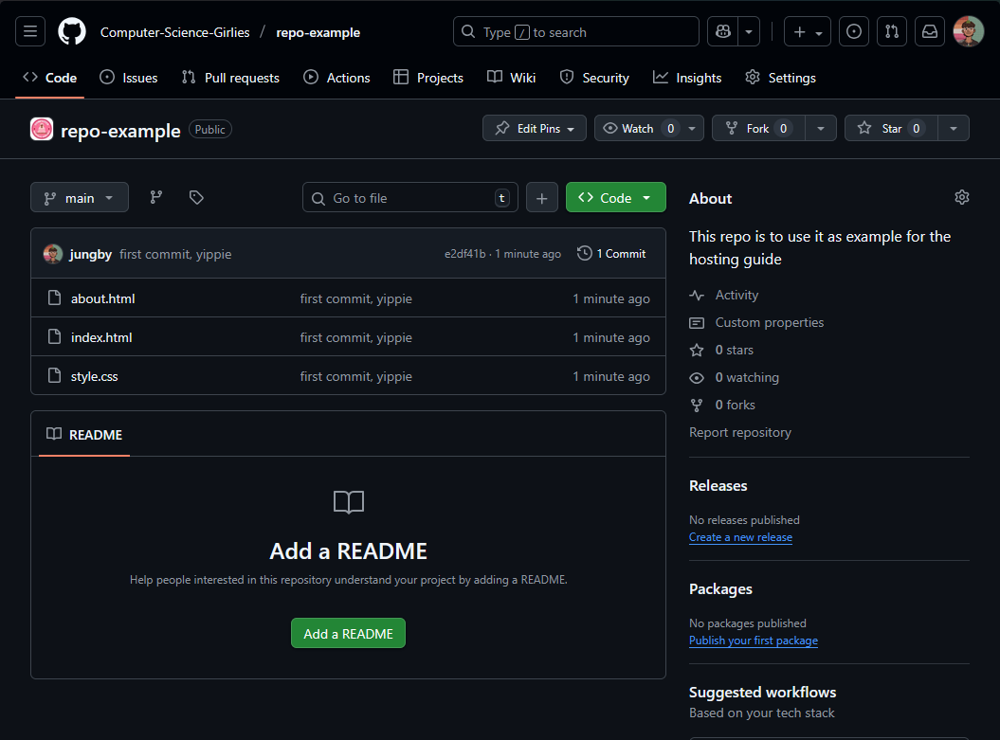
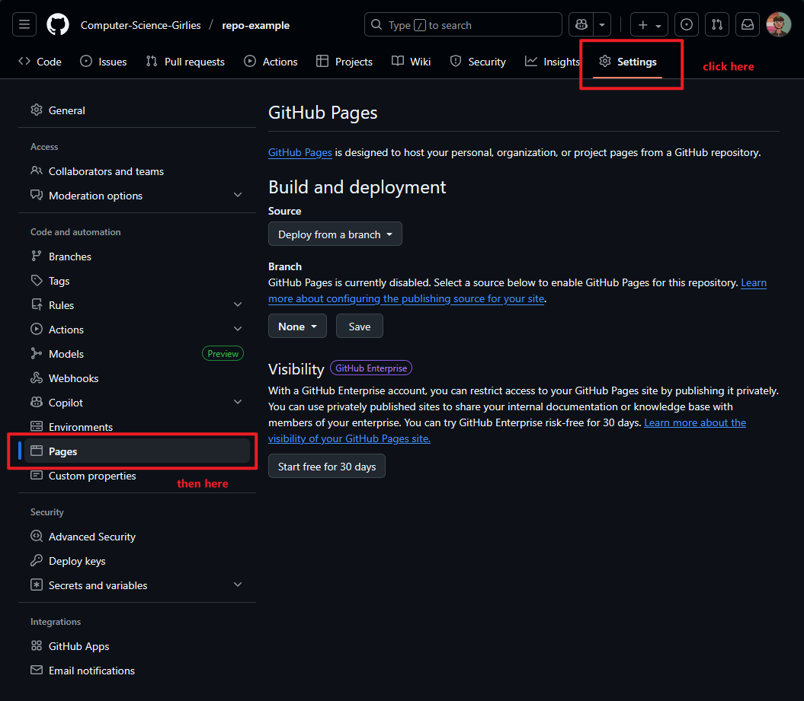
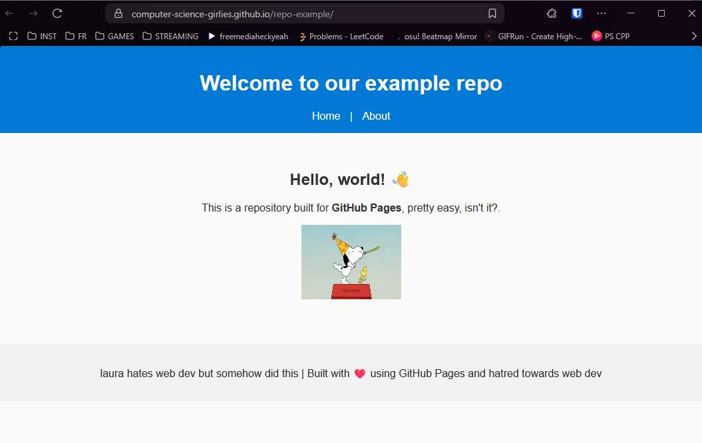

## 💡 What is GitHub Pages?
GitHub Pages is a free service provided by GitHub that allows you to host websites directly from your GitHub repositories.
It’s mainly used for personal websites, portfolios, project documentation, and blogs — and the best part is that you don’t need a web server or even advanced coding knowledge to get started.

Essentially, you create a repository, add your HTML/CSS/JS files (or use a static site generator like Jekyll), and GitHub will automatically publish your website online. 🥳

You can only have one main site, but many project sites. So, how do I know my website's link?
It'll look something like this → `https://GITHUB-USERNAME.github.io/` for the main site or `https://GITHUB-USERNAME.github.io/YOUR-REPO-NAME` for your project sites, it's up to you how you organize it 😼

## 🤔 Why GitHub Pages?
 **Pros** | **Cons** |
| ----------- | ----------- |
| Free hosting| Static only — you can’t run backend code (like PHP or databases) |
| Easy setup | Limited customization for non-coders | 
| Version control | File size limits | 
| Secure and fast | Complex builds or frameworks might require GitHub Actions configuration |

## ❓ How does it work?
1. Create a new repository on GitHub.
2. Add your website files — like `index.html`, CSS, and images.
3. Go to the repository settings → Pages section.
4. Choose a branch (usually `main`) and save.
5. After a few minutes, your site will go live at your GitHub Pages URL 🤯

## 😤 Tutorial when????
Right. Now.

1. Code your website — GitHub Pages looks for an `index.html`, `index.md`, or `README.md`. If you don’t have any of these, it won’t know what to display
2. Add, commit, and push it to your repository.
3. Go to Settings, then click on Pages, select your branch in Branch (99.9% of the time is `main`), click on Save.
4. Wait.
5. Done. 🎉

I know it sounds too easy to be truth, but it is what it is. No rocket science behind this.

### 🧐 For visual learners

1. Do all your coding.

2. Push everything to your repo created (in case you don't know how to create a repo → [click here!!](https://docs.github.com/en/repositories/creating-and-managing-repositories/creating-a-new-repository)) *pd: I made a type on the images but I am too lazy to fix it so please ignore.*

3. Check that everything got uploaded properly (just in case)

4. In your repo, go to Settings, then Pages

5. Select your branch and click Save

> Step 5 will activate the [custom domain](./img/hosting_6.png), in case you want to use your own. **It's not neccesary.**
>
> If you're curious, you can go to Actions to [see the deployment](./img/hosting_7.png), **also not neccesary.**

6. Wait until your deployment it's done, it usually don't take long, it depends on the load of your website.
7. Make a mistake (optional)

8. Fix your code and push it like you did in step 2. 

And that's all, wait until your fix gets deployed and see the changes

>🧠 Tip: If you don’t see your update right away, your browser may be showing a cached version.
>Try opening your site in an incognito window or clearing your cache to see the latest version.